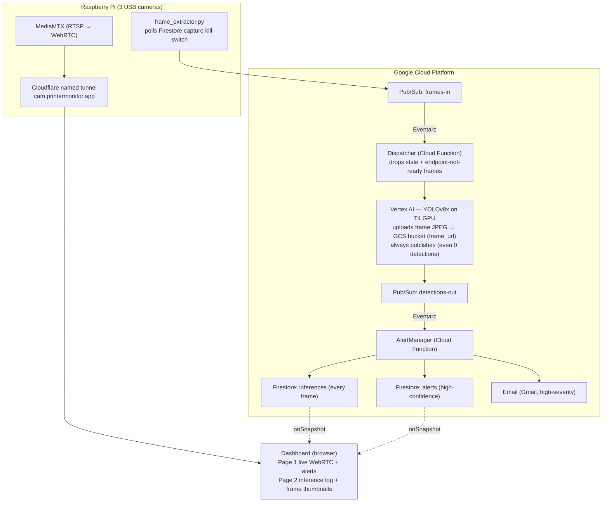

# 3D Printing Failure Detection

Real-time 3D printer failure detection system using YOLOv8x on Google Cloud Vertex AI. Three cameras stream via WebRTC from a Raspberry Pi, while frames are analyzed for defects and alerts are pushed to a live dashboard and email.

## How it works



A Raspberry Pi captures frames from three USB cameras and publishes them to Google Cloud Pub/Sub. A Cloud Function dispatches each frame to a Vertex AI endpoint running a fine-tuned YOLOv8x model inside a custom container. The model runs inference on a T4 GPU, uploads the frame to a public Cloud Storage bucket, and publishes detection results back to Pub/Sub — for **every** frame, including ones with no detections. A second Cloud Function logs every inference to Firestore (`inferences`), writes high-confidence defects to a separate `alerts` collection, and sends email alerts for high-severity defects. The browser dashboard has two pages: live WebRTC streams with real-time alerts, and an inference log showing the captured frames with bounding boxes.

A dashboard toggle writes a `system_state/extraction` flag in Firestore that the Pi polls, so capture can be paused/resumed remotely (useful before undeploying the GPU). The dispatcher also drops frames older than 5 s and drops frames when the endpoint is not ready, so a redeployed model is not overwhelmed by a backlog.

## Detection classes

The model detects 9 failure types with a mean average precision of 0.904 (mAP@0.5):

| Class | mAP@0.5 | Email alert |
|-------|---------|-------------|
| Spaghetti | 0.942 | Yes |
| Not sticking | 0.985 | Yes |
| Layer shift | 0.934 | Yes |
| Warping | 0.873 | Yes |
| Stringing | 0.971 | No |
| Under-extrusion | 0.883 | No |
| Over-extrusion | 0.812 | No |
| Nozzle clog | 0.821 | No |
| Foreign object on print area | 0.918 | No |

> The high-severity classes (Spaghetti, Not sticking, Layer shift, Warping) trigger an email; the rest are logged to the dashboard only. Note the exact model label for spaghetti is `spagetti` (single `h`).

## Dashboard

The dashboard is a vanilla-JS single page served from Firebase Hosting, with two tabs:

- **Live streams** — WebRTC streams from all three cameras via WHEP, with bounding-box overlays, a real-time event log, and a capture ON/OFF toggle.
- **Inference log** — per-camera thumbnails of the most recent inference frames (pulled from the public frames bucket) and a live table of the last 100 inferences, each with its detections and a click-to-enlarge frame.

## Tech stack

**Edge (Raspberry Pi)**
- MediaMTX — RTSP to WebRTC media server
- OpenCV — frame capture and encoding
- Cloudflare Tunnel — exposes WebRTC to the internet

**Cloud (Google Cloud Platform)**
- Vertex AI — model serving with T4 GPU
- Cloud Functions (Gen2) — serverless event processing
- Pub/Sub — message broker between services (with dead-letter queues)
- Firestore — real-time alert + inference storage
- Cloud Storage — public bucket for inference frame images
- Cloud Monitoring — function-error and Pub/Sub-backlog alert policies
- Artifact Registry — Docker container images
- Firebase Hosting — dashboard

**ML**
- YOLOv8x — fine-tuned on 9 3D printing defect classes
- PyTorch 2.2 + CUDA 12.1

**Infrastructure**
- Terraform — all cloud resources as code
- GitHub Actions — CI/CD for Terraform and Docker builds
- Checkov — security scanning
- tflint — Terraform linting

## Project structure

```
├── .github/workflows/
│   ├── terraform.yml              # Lint → Plan → Apply
│   ├── python-tests.yml           # pytest + 90% coverage gate
│   ├── docker-judge.yml           # Build + push judge container
│   ├── firebase-deploy.yml        # Deploy dashboard + Firestore rules
│   └── compileLatex.yml           # Compile thesis PDF
├── terraform_v2/
│   ├── terraform/
│   │   ├── main.tf                # All GCP resources
│   │   ├── variables.tf           # Input variables
│   │   └── outputs.tf             # Output values
│   └── services/
│       ├── alert-manager/         # Detection + budget alert handlers (email)
│       ├── dispatcher/            # Frames → Vertex AI relay (+ staleness filter)
│       ├── judge/                 # YOLOv8x inference container (+ frame upload)
│       ├── frame-extractor/       # Dockerfile (Cloud Run alternative)
│       └── mediamtx/              # Dockerfile + config (runs on Pi)
├── pi_codes/                      # Scripts that actually run on the Pi
│   ├── frame_extractor.py         # RTSP → Pub/Sub publisher (deployed)
│   ├── start_3cams_rtsp.sh        # GStreamer RTSP pipelines
│   └── image_taker.py             # Dataset capture tool
├── dashboard/                     # Static dashboard (index.html + service worker)
├── scripts/                       # annotate.py (CVAT), flush_firestore.py
├── tests/                         # pytest unit tests (services)
├── local_test/                    # Offline pipeline replica (no GCP)
├── firestore.rules                # Firestore security rules
├── firebase.json                  # Firebase Hosting config
├── docs/latex/                    # Thesis (LaTeX)
└── README.md
```

## Setup

### Prerequisites

- GCP project with billing enabled
- Raspberry Pi with cameras
- Terraform >= 1.6
- gcloud CLI authenticated
- GitHub secrets: `GCP_SA_KEY`, `GMAIL_ADDRESS`, `GMAIL_APP_PASSWORD`

### Deploy infrastructure

```bash
cd terraform_v2/terraform
terraform init
terraform plan -var="gmail_address=YOU@gmail.com" -var="gmail_app_password=YOUR_APP_PASSWORD"
terraform apply
```

### Deploy the model

```bash
# Upload model weights
gsutil cp best.pt gs://printermonitor-488112-models/yolov8x/best.pt

# Build and push judge container (or let GitHub Actions do it on push to main)
docker build -t europe-west1-docker.pkg.dev/printermonitor-488112/printermonitor/judge:latest \
  terraform_v2/services/judge/
docker push europe-west1-docker.pkg.dev/printermonitor-488112/printermonitor/judge:latest

# Upload the image as a new Vertex AI model version, then deploy it.
# The --service-account=judge-svc is REQUIRED — the container publishes to Pub/Sub
# and writes inference frames to the storage bucket as that identity.
gcloud ai endpoints deploy-model 6900414029643120640 \
  --region=europe-west1 \
  --model=<MODEL_ID> \
  --display-name=judge \
  --machine-type=n1-standard-4 \
  --accelerator=type=nvidia-tesla-t4,count=1 \
  --min-replica-count=1 \
  --max-replica-count=1 \
  --traffic-split=0=100 \
  --service-account=judge-svc@printermonitor-488112.iam.gserviceaccount.com
```

### Start the Pi

```bash
# Start MediaMTX (Docker, host network)
docker run -d --rm --name mediamtx --network host bluenviron/mediamtx:latest

# Start the GStreamer RTSP pipelines
./pi_codes/start_3cams_rtsp.sh

# Start the permanent Cloudflare named tunnel (serves cam.printermonitor.app)
cloudflared tunnel run my-tunnel

# Start frame extractor (the SA key also needs Firestore read for the capture toggle)
export GOOGLE_APPLICATION_CREDENTIALS=/path/to/sa-frame-extractor-key.json
python3 pi_codes/frame_extractor.py
```

### Stop GPU charges

```bash
gcloud ai endpoints undeploy-model 6900414029643120640 \
  --deployed-model-id=<ID> \
  --region=europe-west1
```

## Cost

The system costs pennies when the GPU is not deployed. With the T4 GPU active, expect ~$37/day. A $5 budget alert is configured in GCP. Always undeploy the model after testing.

## License

This project is part of a thesis at Sapientia Hungarian University of Transylvania.