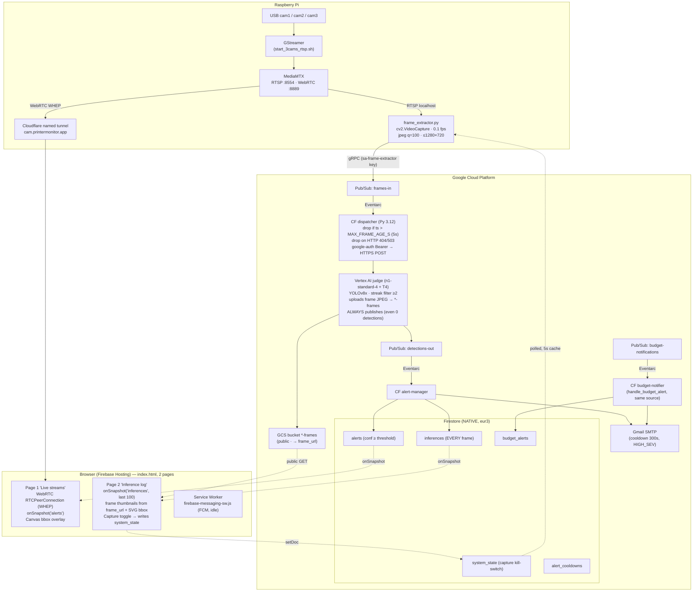

# Architecture & Data Flow

End-to-end view of how a frame becomes an alert. See [[02-cloud-services]] for per-service detail and [[05-infrastructure]] for the IAM and Pub/Sub plumbing.

## Component diagram



## Message contracts

### `frames-in` payload (published by Pi frame extractor)
JSON, UTF-8, base64-wrapped by Pub/Sub:
```json
{
  "camera_id": "cam1",
  "seq": 42,
  "ts": "2026-05-18T12:34:56.789012+00:00",
  "data_b64": "<base64 JPEG>"
}
```

### Vertex AI request (dispatcher → judge)
```json
{
  "instances": [{
    "data_b64": "...",
    "camera_id": "cam1",
    "seq": 42,
    "ts": "2026-05-18T12:34:56+00:00"
  }]
}
```
Judge also accepts the raw Pub/Sub push envelope `{"message":{"data": ...}}` — see `terraform_v2/services/judge/main.py:70-84`.

### `detections-out` payload (published by judge)
```json
{
  "ts": "2026-05-18T12:34:56+00:00",
  "camera_id": "cam1",
  "seq": 42,
  "frame_url": "https://storage.googleapis.com/printermonitor-488112-frames/frames/cam1/2026-05-18T12-34-56-789012-00-00.jpg",
  "detections": [{
    "label": "spagetti",
    "confidence": 0.8721,
    "bbox": [120, 80, 540, 460],
    "x": 0.1875, "y": 0.1667, "w": 0.6563, "h": 0.7917
  }]
}
```
- Both pixel `bbox` and normalized `x,y,w,h` are emitted so the dashboard can overlay without knowing the original frame size.
- `frame_url` points at the uploaded JPEG in the public `*-frames` bucket (empty string if `FRAMES_BUCKET` unset or the upload failed).
- `detections` may be **`[]`** — the judge publishes every inference now, so a zero-detection frame still produces a message (and an `inferences` Firestore doc + a frame thumbnail on page 2).

### Vertex AI response (judge → dispatcher)
```json
{"predictions": [<same as detections-out payload>]}
```

### `budget-notifications` payload (GCP-emitted)
```json
{
  "costAmount": 4.50,
  "budgetAmount": 5.00,
  "budgetDisplayName": "monthly-cap"
}
```

## Hop summary

| #   | Hop                                 | Protocol                                                    | Auth                                                               |
| --- | ----------------------------------- | ----------------------------------------------------------- | ------------------------------------------------------------------ |
| 1   | Cam → MediaMTX                      | RTSP via GStreamer `v4l2src ! v4l2h264enc ! rtspclientsink` | none (loopback)                                                    |
| 2   | MediaMTX → Pi frame_extractor       | RTSP `localhost:8554/camN`                                  | none                                                               |
| 3   | Pi → `frames-in`                    | gRPC                                                        | service account key file (`sa-frame-extractor`) on Pi              |
| 4   | `frames-in` → dispatcher            | Eventarc push (CloudEvent)                                  | Pub/Sub SA token (impersonates dispatcher SA)                      |
| 5   | Dispatcher → Vertex AI              | HTTPS, `Authorization: Bearer`                              | google-auth ADC; dispatcher SA has `roles/aiplatform.user`         |
| 6   | Judge → `detections-out`            | gRPC                                                        | judge container runs as `judge-svc` (manual binding for Vertex AI) |
| 7   | `detections-out` → alert-manager    | Eventarc push                                               | alert-manager SA                                                   |
| 8   | Alert manager → Firestore           | gRPC                                                        | `roles/datastore.user`                                             |
| 9   | Alert manager → Gmail SMTP          | TLS to `smtp.gmail.com:465`                                 | Gmail app password (env var)                                       |
| 10  | Browser → MediaMTX                  | HTTPS WHEP → WebRTC (UDP)                                   | `cam.printermonitor.app` (Cloudflare named tunnel); no app auth    |
| 11  | Browser → Firestore                 | gRPC over HTTPS                                             | Firebase web SDK config (public API key)                           |
| 12  | Judge → `*-frames` bucket           | HTTPS (GCS)                                                 | `judge-svc` object write; objects are public-read                  |
| 13  | Browser → frame thumbnails          | HTTPS GET (public objects)                                  | none (bucket public-read)                                          |
| 14  | Browser → `system_state/extraction` | gRPC over HTTPS (write)                                     | `firestore.rules` allows public read+write on `system_state`       |

## Latency budget (observed during testing, very rough)

| Stage | ms |
|---|---|
| Pi capture + JPEG encode | 50–150 |
| Pi → Pub/Sub publish ack | 100–300 |
| Eventarc dispatch latency | 200–500 |
| Vertex AI inference (T4, YOLOv8x, 720p) | 300–600 |
| `detections-out` → alert-manager → Firestore | 200–400 |
| Firestore → browser onSnapshot | 200–500 |
| **End-to-end frame→bbox in dashboard** | ≈ 1–2 s |

## Failure modes

- **Frames-in backlog**: Pi keeps capturing while judge is undeployed → Pub/Sub stockpiles. **Now largely self-healing**: the dispatcher drops frames older than `MAX_FRAME_AGE_S` (5 s) and drops on 404/503 instead of retrying, so a redeployed judge isn't slammed. The manual Pub/Sub seek ([[09-deployment-ops#Purge frames-in backlog]]) is now a backstop, not a routine necessity. Toggling the [[03-pi-edge#Frame extractor|capture kill-switch]] off before undeploying avoids the backlog entirely.
- **Cooldown leak**: alert_cooldowns docs persist after a test run; new HIGH_SEV detections get suppressed for 5 min. Flush: [[09-deployment-ops#Flush Firestore]].
- **Streak filter on noisy classes**: cables / wire bundles get misclassified as `spagetti` once; streak ≥2 mostly suppresses this — but a sustained mis-detection still fires.
- **Vertex AI cold start**: container takes ~30 s to load YOLOv8x; first POST after deploy will 404/503 and now gets dropped (no retry storm). Once warm, the staleness filter discards the stale queue and live frames flow.
- **Frames bucket growth**: the judge writes one JPEG per inference (every frame, not just defects) to `*-frames` with no lifecycle/TTL rule. At 0.1 fps × 3 cams that's ~26k objects/day — small, but unbounded. See [[11-costs-and-monitoring]] / [[feedback]].
- **Inferences collection growth**: same idea in Firestore — `inferences` accrues a doc per frame forever. `scripts/flush_firestore.py` *does* target it (it's in the `COLLECTIONS` map), but there's no automatic TTL.

See [[12-glossary]] for any term used above.
