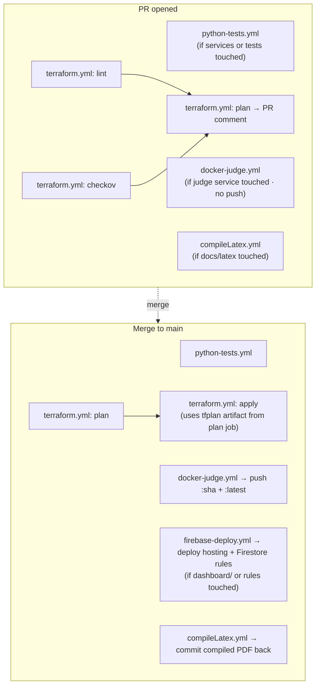

# CI/CD (GitHub Actions + pre-commit)

Five workflows in `.github/workflows/`. None of them are required-status-checks (yet); maintainers can merge regardless of CI state.

## Required GitHub secrets

| Secret | Used by |
|---|---|
| `GCP_SA_KEY` | terraform.yml, docker-judge.yml — JSON key for the CI service account |
| `GMAIL_ADDRESS` | terraform.yml — passed as `TF_VAR_gmail_address` |
| `GMAIL_APP_PASSWORD` | terraform.yml — passed as `TF_VAR_gmail_app_password` |
| `EMAIL` | compileLatex.yml — used as git author email |
| `FULL_NAME` | compileLatex.yml — used as git author name |
| `GITHUB_TOKEN` | compileLatex.yml — implicit, GitHub-provided |

The CI service account needs (at minimum): Storage Admin (state bucket), Cloud Functions Admin, Cloud Run Admin, Pub/Sub Admin, Firestore Admin, IAM Admin, Eventarc Admin, Artifact Registry Writer.

## `python-tests.yml`

**Triggers**: PR and push to `main` when files change under `terraform_v2/services/**`, `tests/**`, `requirements-test.txt`, or the workflow file itself.

**Steps**:
1. checkout
2. `setup-python` 3.12, with pip cache keyed on `requirements-test.txt`
3. `pip install -r requirements-test.txt`
4. `pytest tests/ -v --tb=short --cov=terraform_v2/services --cov-report=term-missing --cov-report=xml --cov-fail-under=90`
5. Upload `coverage.xml` as artifact (always; 14-day retention)

Coverage gate fails the job if < 90%. See [[07-testing]] for what's covered.

## `docker-judge.yml`

**Triggers**: changes to `terraform_v2/services/judge/**` or the workflow file. PR builds the image but doesn't push; main pushes both `:<sha>` and `:latest` tags.

**Build target**: `europe-west1-docker.pkg.dev/printermonitor-488112/printermonitor/judge`

**Steps**:
1. checkout
2. `google-github-actions/auth@v2` with `GCP_SA_KEY`
3. `setup-gcloud@v2`, project `printermonitor-488112`
4. `gcloud auth configure-docker europe-west1-docker.pkg.dev`
5. **Download weights from GCS**: `gsutil cp gs://printermonitor-488112-models/yolov8x/best.pt terraform_v2/services/judge/best.pt`
6. `docker build -t .../judge:<sha> -t .../judge:latest terraform_v2/services/judge/`
7. On main + push event: `docker push` both tags and append a summary line

**Important**: pushing a new image to `:latest` does **not** redeploy Vertex AI. You still need to manually `gcloud ai models upload` + `endpoints deploy-model` ([[09-deployment-ops#Vertex AI deploy]]).

## `terraform.yml`

**Triggers**: changes under `terraform_v2/terraform/**`, `terraform_v2/services/**`, or the workflow file. PR plans and comments; main applies.

**Three jobs**:

### `lint`
- `terraform fmt -check -recursive`
- `tflint --init --config .tflint.hcl` then `tflint --recursive`

### `checkov`
- `bridgecrewio/checkov-action@v12` with `.checkov.yaml`
- `soft_fail: true` — surfaces findings as warnings, doesn't block

### `plan` (needs `lint` + `checkov`)
- Authenticates to GCP
- `terraform init` (GCS backend)
- `terraform plan -no-color -out=tfplan 2>&1 | tee plan_output.txt`
- `actions/github-script@v7` posts the plan as a PR comment (truncated to 60k chars)
- Upload `tfplan` + any `*.zip` as artifact

### `apply` (`main` push only, needs `plan`)
- Downloads the `tfplan` artifact from the plan job
- `terraform apply -input=false tfplan`
- Environment: `production` — gives GitHub a hook for required reviewers / wait timers (currently no reviewers configured)

> **Note**: the apply consumes the *exact plan from the PR comment*. Drift between merge and apply is impossible — Terraform fails if the resources changed since the plan was generated.

## `firebase-deploy.yml`

**Triggers**: push to `main` when `dashboard/**`, `firestore.rules`, `firebase.json`, or the workflow file itself change.

**Steps**:
1. checkout
2. `google-github-actions/auth@v2` with `GCP_SA_KEY`
3. `npm install -g firebase-tools`
4. `firebase deploy --only hosting,firestore:rules --project printermonitor-488112 --non-interactive`

Firebase CLI authenticates via the `GOOGLE_APPLICATION_CREDENTIALS` environment variable set by `google-github-actions/auth@v2` — no extra login step required.

**Required IAM**: the CI service account (`sa-cicd@printermonitor-488112.iam.gserviceaccount.com`) needs `roles/firebasehosting.admin` on the project. This was granted via:
```bash
gcloud projects add-iam-policy-binding printermonitor-488112 \
  --member="serviceAccount:sa-cicd@printermonitor-488112.iam.gserviceaccount.com" \
  --role="roles/firebasehosting.admin"
```

**Note on `firebase.json`**: this file was previously blocked by the `*.json` entry in `.gitignore`. The fix was adding an `!firebase.json` exception immediately after the `*.json` rule.

## `compileLatex.yml`

**Triggers**: changes under `docs/latex/**`.

**Steps**:
1. checkout (with token to allow push back)
2. `apt-get install texlive-latex-extra texlive-lang-european texlive-science ghostscript`
3. `cd docs/latex/docs && pdflatex main.tex && bibtex main && pdflatex main.tex && pdflatex main.tex` (the standard 3-pass)
4. `ghostscript -sDEVICE=pdfwrite -dPDFSETTINGS=/printer` → `Template_thesis_compressed.pdf`
5. Commit `main.pdf` + `Template_thesis_compressed.pdf` back to the repo with `[skip ci]` in the message

The `[skip ci]` tag prevents an infinite loop (the workflow's own commit would otherwise re-trigger it).

This is the only workflow that pushes to `main` directly. Uses `secrets.EMAIL` / `secrets.FULL_NAME` for the git author identity.

## Pre-commit (`.pre-commit-config.yaml`)

Runs locally on `git commit`. Same set as CI minus the GCP auth steps.

Hooks:
1. `terraform_fmt`
2. `terraform_tflint` with `--init` + `--recursive`
3. `checkov` via `.checkov.yaml`
4. **local** `pytest` hook — `python3 -m pytest tests/ -q --tb=short --cov=terraform_v2/services --cov-fail-under=90`, `always_run: true`, `pass_filenames: false`

```bash
# Install hooks
pre-commit install

# Manually run all hooks
pre-commit run --all-files
```

Hooks pinned with `default_language_version.python: "3.10"`. The pytest hook uses `language: system` so it uses whatever Python is on PATH.

## CI dependency graph



Note that `compileLatex.yml` will fail with permission denied if `secrets.EMAIL` / `secrets.FULL_NAME` aren't set; it's a thesis-only convenience.

## Things you might want, that aren't here

- **Pi codes** — no syntax check or test workflow.
- **Scripts** — `scripts/annotate.py` and `scripts/flush_firestore.py` aren't covered.
- **Vertex AI deploy** — manual (see [[09-deployment-ops]]). Adding this would be useful but tricky given the cost implications.
- **Required status checks on branch protection** — main is fully unprotected at the time of writing.
